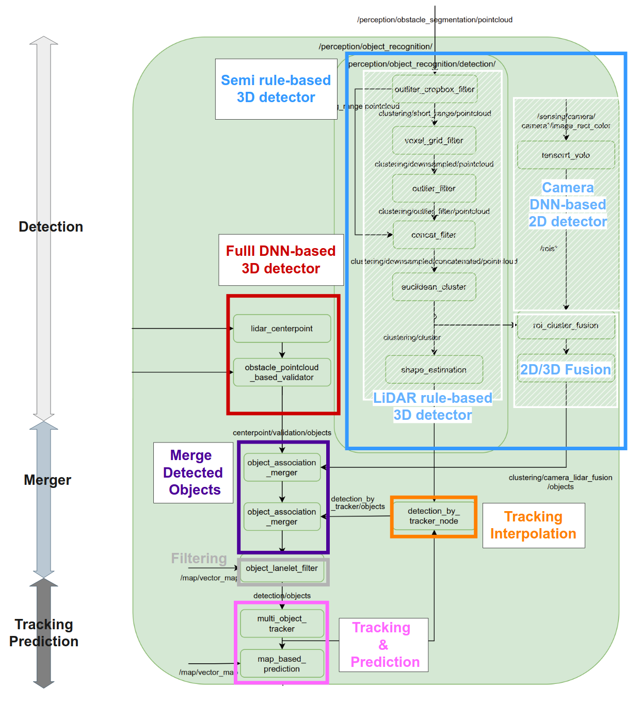

# Perception component design

!!! warning

    Under Construction

## Overview

The Perception Component receives inputs from Sensing, Localization, and Map components, and adds semantic information (e.g., Object Recognition,  Obstacle Segmentation, Traffic Light Recognition, Occupancy Grid Map), which is then passed on to Planning Component.

## Requirements

The goal of the Perception component is to accurately perform Object Recognition, Traffic Light Recognition, and Blind-spot Detection from sensor information.

**Goals:**

- The basic functions are provided so that a simple ODD can be defined.
- 物体や信号を正しく認識できる。距離の制約あり。
- 多種多様なセンサや環境に適応可能な認識アルゴリズム
- The capability is extensible with the third-party components.

**Non-goals:**

- The Perception component is not self-contained but can be extended with third parties.
- The Perception component is not aimed at the complete functionality and capability.
- The Perception component is not designed to always outperform human drivers.
- The Perception component is not capable of achieving "zero overlooks" or "error-free recognition".

## High-level architecture

This diagram describes the high-level architecture of the Perception Component.

The Perception component consists of the following sub-components:

- **Object Recognition**: Recognizes dynamic objects surrounding the ego vehicle in the current frame and predicts their future trajectories.
  - **Detection**: Detects the pose and velocity of dynamic objects such as vehicles and pedestrians.
      - **Detector**: Triggers object detection processing frame by frame.
      - **Interpolator**: Maintains stable object detection. Even if the output from Detector suddenly becomes unavailable, Interpolator uses the output from the Tracking module to maintain the detection results without missing any objects.
  - **Tracking**: Associates detected results across multiple frames.
  - **Prediction**: Predicts trajectories of dynamic objects.
- **Obstacle Segmentation**
  - 動物体に加え、静止障害物のような、衝突したくないものを検出します。例えば工事用のコーンはこのモジュールで認識しています。
- **Occupancy Grid Map**
  - 死角（情報が得られない、動物体が飛び出してくる可能性のある領域）を検出
- **Traffic Light Recognition**
  - 信号認識

## Component interface

The following describes the input/output concept between Perception Component and other components. See the [Perception Component Interface (WIP)](../../autoware-interfaces/components/perception.md) page for the current implementation.

### Input to the perception component

- **From Sensing**
  - Camera: 信号認識と2d detectionに使用
  - Point Cloud: 物体認識に使用
  - Radar: 物体認識に使用
- **From Localization**
  - Vehicle motion information: Includes the ego vehicle's position.
- **From Map**
  - Vector map: lanelet filterに使用
  - Point Cloud Map: compare map filterに使用

### Output from the perception component

- **To Planning**
  - 動物体:
  - Obstacle Segmentation:
  - Occupancy Grid Map:
  - 信号認識:

### Internal interface in the perception component

- **Obstacle Segmentation to Object Recognition**
  - Obstacle Segmentationの結果をfilterにかけて、LiDAR rule-based 3D detectorに使用する。
- **Obstacle Segmentation to Occupancy Grid Map**
  - Obstacle Segmentationの結果を使ってOccupancy Grid Mapを作成する

## How to add new modules (WIP)

As mentioned in the goal session, this perception module is designed to be extensible by third-party components. For specific instructions on how to add new modules and expand its functionality, please refer to the provided documentation or guidelines (WIP).

## Supported Functions

## Reference Implementation

The following diagram describes the reference implementation of the Perception component. By adding new modules or extending the functionalities, various ODDs can be supported.

_Note that some implementation does not adhere to the high-level architecture design and require updating._

For more details, please refer to the design documents in each package.

### Important Parameters

| Package           | Parameter               | Type   | Description                                                                                                                                                                                                                                            |
| ----------------- | ----------------------- | ------ | ------------------------------------------------------------------------------------------------------------------------------------------------------------------------------------------------------------------------------------------------------ |
| perception launch | `mode`                  | string | detectionのmode. options: `camera_lidar_radar_fusion`, `camera_lidar_fusion`, `lidar_radar_fusion`, `lidar` or `radar` <https://github.com/autowarefoundation/autoware.universe/blob/main/launch/tier4_perception_launch/launch/perception.launch.xml> |
| perception launch | `lidar_detection_model` | string | lidar detection modelのmodel. options: `centerpoint`, `apollo`, `pointpainting`, `clustering`                                                                                                                                                          |
| perception launch | `use_object_filter`     | string | unknown objectを、laneletを用いてfilterするかどうかを決める                                                                                                                                                                                            |
| `object_merger`   | `priority_mode`         | int    | detetorをmergeする際の、detector同士の優先順位を決める `0: Object0, 1: Object1, 2: Confidence`                                                                                                                                                         |

### Notation
